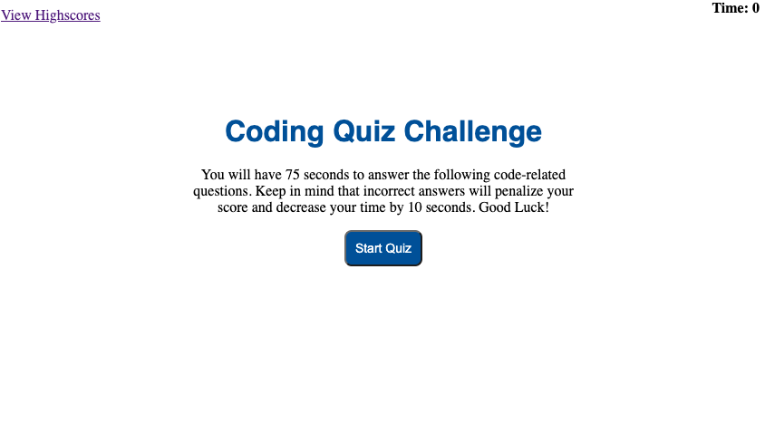

# Code-Quiz

## Description

Code Quiz is a timed multiple choice code quiz. Users can take the quiz and record their high scores. 

## Table of Contents

* [Description](#description)
* [Technology](#technology)
* [User Story](#user-story)
* [Installation](#installation)
* [Usage](#usage)
* [License](#license)
* [Contributing](#contributing)
* [Tests](#tests)
* [Questions](#questions)
* [Deployed Application URL](#deployed-application-URL)

## Technology

- HTML
- CSS
- JavaScript

## User Story

AS A coding bootcamp student
I WANT to take a timed quiz on JavaScript fundamentals that stores high scores
SO THAT I can gauge my progress compared to my peer

## Installation

No installation needed. 

## Usage

The deployed application link will take you to the homepage. Clicking on the "Start Quiz" button will begin the quiz. A 75 seconds timer will start. Each inocrrect answer deducts the timer by 10 seconds. Each correct answer increases your score. Your total score is calculated and displayed at the end of the quiz. Users will enter their initials. Current and previous highscores can be viewed by clicking on the view highscores link.

## License

## Contributing

Please follow standard contributing guidelines.

## Tests

No tests to run.

## Questions

For any questions, please contact kendayao at kendayao@gmail.com

## Deployed Application URL

Deployed application link: https://kendayao.github.io/Code-Quiz/

Video demo link: https://giphy.com/gifs/chEtXyFkGzGclH4Oqd/fullscreen

